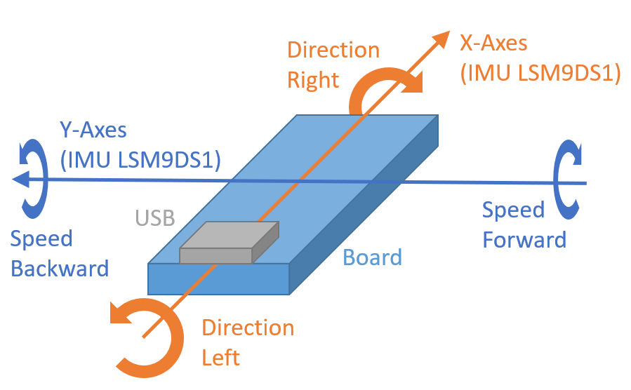

# Bluetooth Remote Control for Lego Technic Hub

This is an arduino sketch to control the assembled LEGO Technic vehicles via the Bluetooth LE interface and IMU sensor.

## Requirements
- [Arduino IDE](https://www.arduino.cc/en/Main/Software)
- [Visual Studio Code (optional)](https://code.visualstudio.com/)
    - Supports Intellisense
    - [Extension for Arduino](https://marketplace.visualstudio.com/items?itemName=vsciot-vscode.vscode-arduino)
- [Arduino NANO 33 BLE Sense](https://store.arduino.cc/arduino-nano-33-ble-sense) ([Getting Started Guide](https://www.arduino.cc/en/Guide/NANO33BLESense))

## Installation
Just download the sketch with your preferred IDE to the board. If you want to have debug information you might uncomment the `#define DEBUG` line at the beginning of the sketch. If you do so and upload it to the remote it will wait after power on until a serial terminal is connected.

## Current supported vehicles
- Lego Technic 4x4 Offroader 42099

## Initialization Sequence
ATTENTION: After you powered on the remote and pushed the green button on the Technic HUB the vehicle will automatically steer to the left and right to measure the steering range and center position.

Power on your remote (Arduino Board). The easiest way might be to supply it via USB. Now it will scan for BLE Devices with the name **Technic Hub**. If the central found one it will connect to it immediately and the blue LED on the board will be switched on.  
The remote will send some setup commands to the hub so the two motors on port A and B get mapped to one virtual port. For the last step the steering range and the central position for the steering will be initialized. 

## Steering the vehicle
Rotating the board around the Y-axes will increase/decrease speed. So you can move the vehicle forward and backward. Like in case rotating around the X-axes will allow you to steer your vehicle.  
The picture below shows the **Arduino NANO 33 BLE Sense** and its orientation to control a vehicle.

