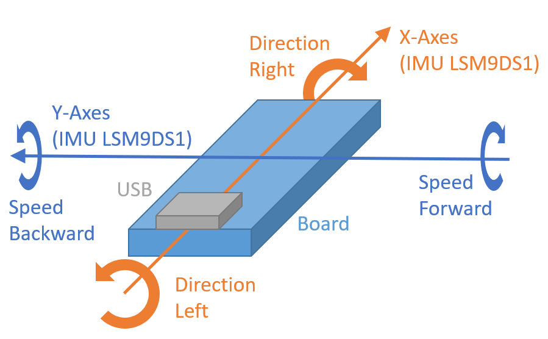

# Bluetooth Remote control for Lego Technic Hub

This is an arduino sketch to control the assembled motions via the Bluetooth LE interface.

## Requirements
- Arduino IDE  
- Visual Studio Code (optional)  
- Arduino NANO 33 BLE Sense  

## Current supported vehicles
- Lego Technic 4x4 Offroader 42099

## Initialization Sequence
ATTENTION: After you powered on the remote and also pushed the green button on the Technic HUB the vehicle will automatically steer to the left and right to measure the steering range and center position.

Power on your remote (Arduino Board). The easiest way might be to supply it via USB. Now it will scan for BLE Devices with the name "Technic Hub". If the central found one it will connect to it immediately and the blue LED on the board will be switched on.  
The remote will send some setup commands to the hub so the two motors on port A and B get mapped to one virtual port. For the last step the steering range and the central position for the steering will be initialized. 

## Steering the vehicle
Rotating the board around the Y-axes will increase/decrease speed. So you can move the vehicle forward and backward. Like in case rotating around the X-axes will allow you to steer your vehicle.
